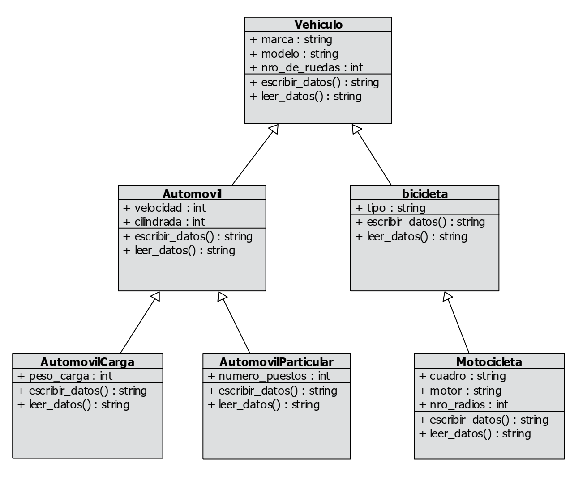

# Práctica de consolidación Módulo 4: Sistema de Control de Vehiculos

Clases y herencia en Python

## Descripción

Sistema para el control de vehículos en un sistema de peaje segpun el siguiente diagrama de clases

.

## Repositorio

https://github.com/est-md/consolidacion_m4.git